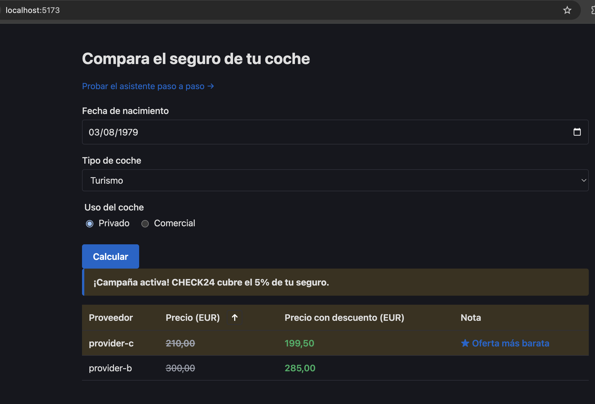
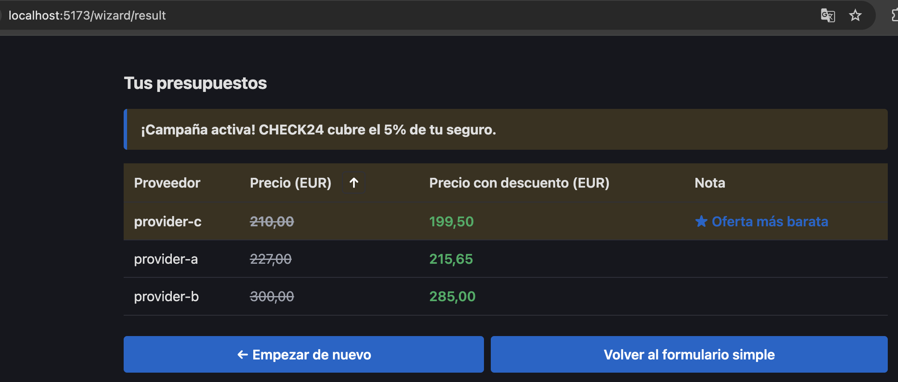
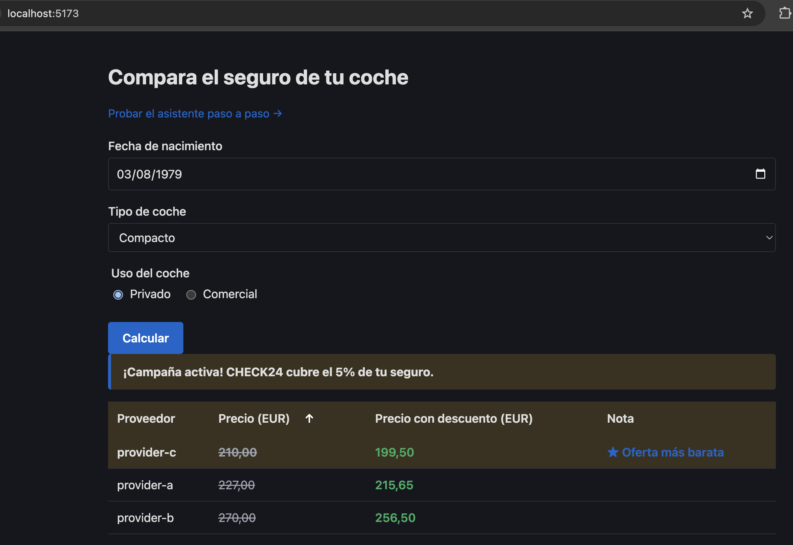

# CHECK24 Car Insurance Comparison

A small fullstack application that compares car-insurance quotes from multiple
simulated providers. Built as a code challenge for the CHECK24 fullstack role.

- **Backend** — Symfony 7.3 on PHP 8.4. Three mock provider endpoints
  (JSON / XML / CSV) plus a `/calculate` orchestrator that fans out in parallel
  with a hard 10 s timeout, applies a configurable campaign discount, and sorts
  by final price. OpenAPI documentation, JSON structured logging, and a
  per-request `request_id` for log correlation.
- **Frontend** — Vue 3 + TypeScript + Vite SPA with two entry points: a
  single-page form on `/` and an iOS-style 3-step wizard on `/wizard`. Form
  state survives reload via `sessionStorage`. Results table is hand-coded
  (no UI library), with cheapest-row highlight and asc/desc sort toggle.
- **Runtime** — everything runs in Docker; a single `Makefile` is the
  entry point for every developer task.

The full plan, requirements, specification, implementation order, validation
strategy and decision log live in [`docs/plan/`](./docs/plan/).

---

## Prerequisites

Only **Docker** (with Compose v2) and **GNU Make**. No local PHP, Composer
or Node installation is needed — every command runs inside a container.

| Default port | Service                 | Override via      |
| -----------: | ----------------------- | ----------------- |
|       `8080` | nginx → Symfony API     | `NGINX_HOST_PORT` |
|       `5173` | Vite dev server (Vue 3) | `VITE_HOST_PORT`  |

---

## Quickstart

```bash
cp .env.example .env

make build         # build all images
make install       # composer install + npm install (inside containers)
make up-d          # start the stack in the background
make test          # run all 215 tests (113 backend + 102 frontend)
make lint          # PHPStan level 10 + PHP-CS-Fixer + ESLint + Prettier + vue-tsc
make coverage      # PHPUnit Clover + Vitest LCOV reports
make sonar         # upload analysis to SonarCloud (needs SONAR_TOKEN)
```

Then open in a browser:

| URL                                  | What                                                  |
| ------------------------------------ | ----------------------------------------------------- |
| http://localhost:5173                | Single-page form (default)                            |
| http://localhost:5173/wizard         | 3-step iOS-style wizard with slide transitions        |
| http://localhost:8080/calculate      | `POST` JSON endpoint (the API the SPA calls)          |
| http://localhost:8080/api/doc        | Swagger UI                                            |
| http://localhost:8080/api/doc.json   | Raw OpenAPI 3.0 spec                                  |

A first-time bootstrap is not normally needed — the `backend/` and
`frontend/` source trees are committed. If you ever need to recreate them
from scratch (e.g. to upgrade Symfony or Vite versions), `make bootstrap`
runs `composer create-project symfony/skeleton:^7.3 backend` and
`npx create-vite frontend --template vue-ts` in throwaway containers.

---

## Screenshots

### Single-page form with results (`/`)

Filled form, active campaign banner, hand-coded results table with the cheapest
quote highlighted. Note that `provider-a` is missing from this run — it hit the
simulated 10% random failure (the backend dropped it from the response with a
JSON log line; the UI shows the surviving providers only).



### Wizard result page (`/wizard/result`)

After walking through the three wizard steps, the result page renders the same
shared `QuoteResults` component with the campaign banner, ascending sort, and
cheapest highlight. The two CTAs at the bottom let the user restart the wizard
or fall back to the single-page form.



### Responsive layout (narrow viewport)

The `.page` container drops to `max-width: 480px` below tablet breakpoints; the
results table reflows without horizontal scroll, and the form fields keep their
labels stacked. All three providers responded for this run.



---

## Make targets

`make help` prints the live, colour-coded menu. Targets are grouped by
workflow — the seven groups below mirror what you'll see there.

### Setup — first-time and one-off

| Target                  | Purpose                                                                  |
| ----------------------- | ------------------------------------------------------------------------ |
| `make bootstrap`        | One-time — create Symfony & Vue projects via throwaway containers (idempotent; skips if already present) |
| `make bootstrap-backend`  | Just the Symfony skeleton (`composer create-project symfony/skeleton:^7.3 backend`) |
| `make bootstrap-frontend` | Just the Vue skeleton (`npm create vite@latest frontend -- --template vue-ts`) |
| `make build`            | Build the three Docker images (backend, frontend, nginx)                 |
| `make install`          | `composer install` + `npm ci`                                            |
| `make install-backend`  | Just `composer install` inside the backend image                         |
| `make install-frontend` | Just `npm ci` inside the frontend image                                  |

### Run — daily lifecycle

| Target          | Purpose                              |
| --------------- | ------------------------------------ |
| `make up`       | Start the full stack (foreground)    |
| `make up-d`     | Start the full stack (detached)      |
| `make down`     | Stop the stack (keeps named volumes) |
| `make logs`     | Tail logs from every service         |
| `make ps`       | Show running services                |

### Containers — drop into a shell

| Target                | Purpose                                       |
| --------------------- | --------------------------------------------- |
| `make shell-backend`  | Bash shell inside the backend (PHP) container |
| `make shell-frontend` | Sh shell inside the frontend (Node) container |

### Test — PHPUnit + Vitest

| Target               | Purpose                                |
| -------------------- | -------------------------------------- |
| `make test`          | Run all tests (backend + frontend)     |
| `make test-backend`  | Just PHPUnit (113 cases)               |
| `make test-frontend` | Just Vitest (102 cases)                |

### Coverage & SonarCloud

| Target                   | Purpose                                                                |
| ------------------------ | ---------------------------------------------------------------------- |
| `make coverage`          | Generate PHPUnit (Clover) + Vitest (LCOV) reports                      |
| `make coverage-backend`  | Just PHPUnit with pcov → `backend/var/coverage/clover.xml`             |
| `make coverage-frontend` | Just Vitest with v8 → `frontend/coverage/lcov.info`                    |
| `make sonar`             | Upload analysis to SonarCloud (requires `SONAR_TOKEN` in env)          |

`make sonar` runs `sonarsource/sonar-scanner-cli` against the host repo
via Docker — no SonarScanner or Node install on the host needed. The
SonarCloud project is `jcmoro_code-challenger-check`; config lives in
[`sonar-project.properties`](./sonar-project.properties).

### Quality — lint + static analysis (check mode)

| Target           | Purpose                                                       |
| ---------------- | ------------------------------------------------------------- |
| `make lint`      | Run every check (stan + cs + eslint + prettier + typecheck)   |
| `make stan`      | PHPStan analysis                                              |
| `make cs`        | PHP-CS-Fixer (dry-run, fails on drift)                        |
| `make eslint`    | ESLint (fails on any warning)                                 |
| `make prettier`  | Prettier `--check`                                            |
| `make typecheck` | `vue-tsc --noEmit` (strict TypeScript)                        |

### Fix — auto-fixers in write mode

| Target              | Purpose                                  |
| ------------------- | ---------------------------------------- |
| `make fix`          | Apply every auto-fixer                   |
| `make fix-backend`  | PHP-CS-Fixer in write mode               |
| `make fix-frontend` | ESLint `--fix` + Prettier `--write`      |

### Reset — destructive, prompts first

| Target       | Purpose                                                                |
| ------------ | ---------------------------------------------------------------------- |
| `make clean` | Remove containers, named volumes, and build artefacts (asks `[y/N]`)   |

Plus `make help` (the default goal) to print the live menu.

---

## Project layout

```
.
├── Makefile
├── docker-compose.yml
├── docker-compose.override.yml
├── .env.example
├── sonar-project.properties # SonarCloud monorepo config + rule overrides
├── docker/                  # Dockerfiles + service configs
│   ├── php/                 # PHP 8.4-fpm-alpine with required extensions + pcov
│   ├── nginx/               # 1.27-alpine fronting PHP-FPM
│   └── node/                # Node 20-alpine running Vite dev
├── docs/
│   ├── Technical_case_semotor[18].pdf
│   └── plan/                # Six planning documents — see below
├── backend/                 # Symfony 7.3 / PHP 8.4
│   ├── src/
│   │   ├── Domain/          # Pure value objects (DriverAge, Money, Quote, …)
│   │   ├── Application/     # Use cases (CalculateQuoteHandler, …)
│   │   ├── Infrastructure/  # Adapters: Provider{A,B,C}{Client,PricingService,Simulator}, System services
│   │   └── UI/Http/         # Controller + DTO + Response/CalculateQuoteResponseFactory + listeners
│   ├── config/
│   └── tests/
└── frontend/                # Vue 3 + TypeScript + Vite
    ├── src/
    │   ├── api/             # fetch wrapper + typed /calculate call
    │   ├── domain/          # TS mirrors of the backend's JSON contract
    │   ├── composables/     # useFormState (sessionStorage), useCalculate, useSort
    │   ├── components/      # form/, results/, feedback/, wizard/
    │   ├── pages/           # HomePage + wizard/{Step1…Step3, WizardResult}
    │   ├── router/          # vue-router with iOS slide-direction tracking
    │   └── i18n/            # Spanish strings
    └── tests/
```

---

## Planning documents

Six markdown documents in [`docs/plan/`](./docs/plan/) capture the
"thinking" the spec asks for. Each is self-contained:

1. [`constitution.md`](docs/plan/constitution.md) — principles, non-negotiables, decision heuristics, explicit out-of-scope items.
2. [`requirements.md`](docs/plan/requirements.md) — functional + non-functional requirements derived from the PDF, plus project-level additions (Docker, Makefile, static analysis, automated tests). Includes a traceability matrix.
3. [`specification.md`](docs/plan/specification.md) — detailed contracts: API request/response shapes, vocabulary mapping table (user-facing ↔ each provider), error semantics, frontend component structure.
4. [`implementation.md`](docs/plan/implementation.md) — eight phased build plan with exit criteria, technology choices (locked), repo layout, Makefile sketch, and effort estimate.
5. [`validation.md`](docs/plan/validation.md) — five-layer validation strategy (tooling → unit → integration → end-to-end → reviewer walk-through), exhaustive pricing test tables, binary acceptance criteria.
6. [`replanning.md`](docs/plan/replanning.md) — the change log: 30 entries documenting every decision that drifted from the original plan, with trigger / change / impact / cost / risk for each.

---

## How the system behaves

### `POST /calculate` — the customer's call

```json
{
  "driver_birthday": "1992-02-24",
  "car_type":        "Turismo",
  "car_use":         "Privado"
}
```

The handler:

1. Computes age from birthday using an injected `Clock` (deterministic in tests).
2. Reads the campaign state from `CampaignProvider` (env-backed by default).
3. Fans out to **all** registered `QuoteProvider`s in parallel via
   `HttpClient::stream()` with a hard **10 s** per-request timeout.
4. Failed providers (5xx, transport error, parse error, timeout) are
   **dropped** — their ids land in `meta.failed_providers`; the response
   stays at 200.
5. Applies the 5% campaign discount (when active) to each surviving quote.
6. Sorts ascending by final price, ties broken by provider id.
7. Marks the single cheapest quote with `is_cheapest: true`.

Response (campaign active):

```json
{
  "campaign": { "active": true, "percentage": 5.0 },
  "quotes": [
    {
      "provider": "provider-c",
      "price":            { "amount": 210.0,  "currency": "EUR" },
      "discounted_price": { "amount": 199.5,  "currency": "EUR" },
      "is_cheapest": true
    },
    {
      "provider": "provider-a",
      "price":            { "amount": 317.0,  "currency": "EUR" },
      "discounted_price": { "amount": 301.15, "currency": "EUR" },
      "is_cheapest": false
    }
  ],
  "meta": { "duration_ms": 5132, "failed_providers": ["provider-b"] }
}
```

Validation errors come back as `400` with a uniform envelope, regardless of
whether the violation was caught by Symfony's `MapRequestPayload` or thrown
from the domain (`UnderageDriverException` for age < 18, future birthday, …):

```json
{
  "error": "validation_failed",
  "violations": [
    { "field": "driver_birthday", "message": "Driver must be at least 18 years old, got 17." }
  ]
}
```

### The three providers (simulated)

| Provider     | Format | Latency | Failure mode                   |
| ------------ | ------ | ------- | ------------------------------ |
| `provider-a` | JSON   | 2 s     | HTTP 500 on 10 % of calls      |
| `provider-b` | XML    | 5 s     | 1 % of calls add a 55 s spike  |
| `provider-c` | CSV    | 1 s     | HTTP 503 on 5 % of calls       |

Latency and randomness are injected via `Clock` and `RandomnessProvider`
interfaces so tests run instantly and deterministically.

### Structured logs

`make logs` shows one JSON line per `/calculate` on the `calculate` channel:

```json
{
  "message": "calculate_completed",
  "context": {
    "request_id": "3006038b733f7ab0",
    "duration_ms": 5028,
    "campaign_active": true,
    "campaign_percentage": 5.0,
    "quotes_count": 2,
    "failed_providers": ["provider-a"],
    "providers": {
      "provider-c": { "outcome": "ok",     "duration_ms": 1824 },
      "provider-a": { "outcome": "failed", "duration_ms": 2021 },
      "provider-b": { "outcome": "ok",     "duration_ms": 5026 }
    }
  },
  "level_name": "INFO",
  "channel": "calculate"
}
```

---

## Troubleshooting

- **Port 8080 / 5173 already in use** — set `NGINX_HOST_PORT` and/or
  `VITE_HOST_PORT` in `.env`, or export them inline:
  `NGINX_HOST_PORT=8081 make up-d`. If you change the host port, also point
  `VITE_API_BASE` at the new URL so the SPA can find the API.
- **`/api/doc` returns 500 on first run** — the cache may have been built
  before the bundle was added. Run `make shell-backend` then
  `php bin/console cache:clear` (or simpler: `make down && make up-d`).
- **WebTestCase fails with "Could not find service test.service_container"** —
  the test cache wasn't rebuilt against a `test` environment. Clear it:
  `make shell-backend` then `rm -rf var/cache && php bin/console cache:warmup --env=test`.
- **Frontend can't reach the API in dev** — the dev container reads
  `VITE_API_BASE` (default `http://localhost:8080`). If you changed
  `NGINX_HOST_PORT`, override accordingly.
- **`make clean` removes more than expected** — it prompts for confirmation
  and deletes named volumes (composer cache, npm cache, node_modules). The
  next `make install` rebuilds them.

---

## Submission deliverables checklist

Per the challenge's submission requirements:

- [x] Full source code of backend and frontend.
- [x] Automated tests for backend pricing, comparison/sort, campaign discount.
- [x] Automated tests for frontend components and composables.
- [x] Planning documents in `docs/plan/`.
- [x] Senior bonuses: parallel fetch, OpenAPI, robust error handling,
      structured logging, third provider (CSV), Docker setup, 3-page
      wizard with iOS-style transitions, responsive layout.
