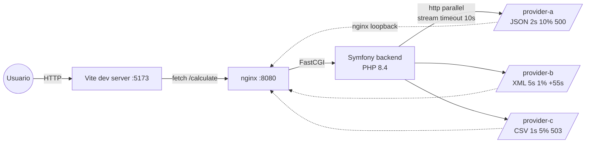

# Arquitectura — code-challenger-check24

> Visión general de la arquitectura del servicio. Para el "qué hace" funcional
> ver [`functional/README.md`](../functional/README.md); para "cómo se ejecuta"
> en detalle ver [`functional/flows/calculate.md`](../functional/flows/calculate.md).

## Descripción

`code-challenger-check24` es un único servicio web que compara cotizaciones de
seguros de coche llamando a tres proveedores simulados. No tiene persistencia
ni autenticación. Bounded context único: **comparación de seguros**.

El servicio cubre dos audiencias:

- **Cliente HTTP** (la SPA Vue.js o cualquier otro): consume `POST /calculate`.
- **Proveedores simulados** (los tres `/provider-*/quote`): expuestos como
  endpoints aparte, accesibles para Postman / curl, pero pensados para ser
  llamados por el propio orquestador via `HttpClient`.

## Patrones arquitectónicos

| Patrón                                | Aplicación en este servicio                                                                          |
| ------------------------------------- | ---------------------------------------------------------------------------------------------------- |
| **Arquitectura por capas (Onion)**    | `Domain` (puro) ← `Application` (casos de uso) ← `Infrastructure` (adaptadores) ← `UI/Http` (controllers) |
| **Ports & Adapters**                  | `QuoteFetcher`, `QuoteProvider`, `CampaignProvider`, `Clock`, `RandomnessProvider` son ports         |
| **Dependency Inversion**              | Los casos de uso dependen de las interfaces, no de las implementaciones                              |
| **Test-time injection** (sin librerías) | `static::getContainer()->set(InterfaceFqcn::class, $fake)` reemplaza servicios públicos en WebTestCase |
| **Tagged Services Iterator**          | `iterable<QuoteProvider>` autorregistra los tres clients via `#[AutoconfigureTag('app.quote_provider')]` |

## Stack tecnológico

| Capa                  | Tecnología                            | Versión |
| --------------------- | ------------------------------------- | ------- |
| Lenguaje              | PHP                                   | 8.4     |
| Framework             | Symfony                               | 7.3     |
| HTTP client           | `symfony/http-client` (multiplex)     | 7.3     |
| API docs              | `nelmio/api-doc-bundle` + `zircote/swagger-php` | ^5.10   |
| Logging               | `symfony/monolog-bundle`              | ^4.0    |
| Tests                 | PHPUnit                               | 13.x    |
| Static analysis       | PHPStan max + PHP-CS-Fixer            | —       |
| Frontend lenguaje     | TypeScript                            | ~6.0    |
| Frontend framework    | Vue.js                                | 3.5     |
| Frontend build/dev    | Vite                                  | ^8.0    |
| Reverse proxy         | nginx alpine                          | 1.27    |
| Runtime               | Docker + Docker Compose               | —       |

El stack está sincronizado con [`docs/README.md`](../README.md). Cuando cambie
uno, actualizar el otro en el mismo commit.

## Diagrama de componentes



Notas:

- En desarrollo, los proveedores simulados viven **dentro del propio backend**.
  El cliente HTTP del backend los alcanza vía nginx (`http://nginx/provider-a/quote`,
  etc.) para asegurarse de ejercer el mismo path que un proveedor remoto.
- En producción, los proveedores serían servicios reales con sus propios DNS;
  bastaría con cambiar `PROVIDER_*_BASE_URL` en `.env`.

## Estructura del código

```
backend/src/
├── Domain/                  # Puro — sin Symfony, sin HTTP, sin I/O
│   ├── Driver/DriverAge.php
│   ├── Car/{CarType,CarForm,TipoCoche,CarUse,UsoCoche}.php
│   ├── Money/Money.php
│   ├── Quote/Quote.php
│   └── Campaign/CampaignState.php
├── Application/             # Casos de uso, interfaces puerto
│   ├── Calculate/{CalculateQuoteCommand,Result,Handler}.php
│   ├── Campaign/{CampaignProvider, EnvCampaignProvider}.php
│   └── Provider/{QuoteProvider, QuoteFetcher, ParallelQuoteFetcher, ProviderOutcome, FetchResult}.php
├── Infrastructure/          # Adaptadores externos
│   ├── Provider/{A,B,C}/Provider{A,B,C}Client.php       # Adaptador HTTP por proveedor
│   ├── Provider/{A,B,C}/Provider{A,B,C}PricingService.php # Lógica de pricing pura
│   └── System/{Clock,SystemClock,RandomnessProvider,MtRandomnessProvider}.php
└── UI/Http/                 # Controllers + DTOs + listeners
    ├── Controller/{Calculate,ProviderA,ProviderB,ProviderC}Controller.php
    ├── Dto/CalculateQuoteHttpRequest.php
    └── EventListener/ValidationFailedListener.php
```

## ADRs

Ver [`adr/README.md`](adr/README.md). Los ADRs iniciales:

| ADR                                                       | Decisión                                                            |
| --------------------------------------------------------- | ------------------------------------------------------------------- |
| [ADR-001](adr/ADR-001-symfony-vue-stack.md)               | Symfony 7.3 + Vue 3 como stack                                       |
| [ADR-002](adr/ADR-002-parallel-fetch-via-httpclient-stream.md) | Fan-out paralelo via `HttpClient::stream()`                          |
| [ADR-003](adr/ADR-003-quotefetcher-interface-for-testability.md) | Interface `QuoteFetcher` introducida para testabilidad del handler   |

## Dependencias externas

Ver [`dependencies.md`](dependencies.md) para la lista completa de paquetes
y servicios externos.

## Reglas de negocio

Ver [`business-rules.md`](business-rules.md) para timeouts, tablas de pricing
y comportamiento ante fallos de proveedores.
