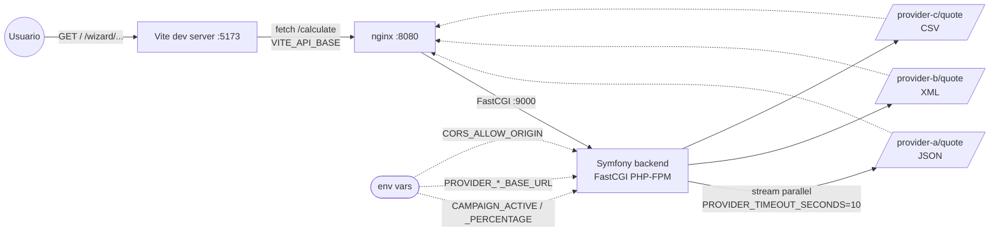

# Mapa de dependencias — code-challenger-check24

> Componentes del sistema, sus dependencias y las variables de entorno que
> los configuran. Generado manualmente; mantener sincronizado con
> `docker-compose.yml`, `backend/.env` y `frontend/package.json`.

## Diagrama del sistema

**Leyenda:**

- Línea sólida → dependencia HTTP en runtime.
- Línea punteada → configuración / loopback (los tres proveedores viven
  dentro del propio backend, expuestos como endpoints separados y alcanzados
  via nginx para reproducir el mismo path que tendría un proveedor remoto).

## Dependencias por componente

### Frontend (`frontend/`)

| Dependencia               | Tipo                  | URL / fichero                              |
| ------------------------- | --------------------- | ------------------------------------------ |
| Backend (`/calculate`)    | HTTP sincronía         | `VITE_API_BASE` (default `http://localhost:8080`) |
| `sessionStorage`          | Almacenamiento browser | clave `quote-form-v1`                       |

### Backend (`backend/`)

| Dependencia                          | Tipo                  | Configuración                                  |
| ------------------------------------ | --------------------- | ---------------------------------------------- |
| Provider A (HTTP, JSON)              | HTTP sincronía         | `PROVIDER_A_BASE_URL` + `/quote`               |
| Provider B (HTTP, XML)               | HTTP sincronía         | `PROVIDER_B_BASE_URL` + `/quote`               |
| Provider C (HTTP, CSV)               | HTTP sincronía         | `PROVIDER_C_BASE_URL` + `/quote`               |
| `monolog.formatter.json` → stderr    | Logging                | Canal `calculate`                              |
| Env var `CAMPAIGN_ACTIVE`            | Configuración          | bool — activa el descuento del 5 %             |
| Env var `CAMPAIGN_PERCENTAGE`        | Configuración          | float — porcentaje (default 5.0)               |
| Env var `PROVIDER_TIMEOUT_SECONDS`   | Configuración          | int — timeout del fan-out (default 10)         |

### nginx (`docker/nginx/`)

| Dependencia                  | Tipo            | Configuración                                  |
| ---------------------------- | --------------- | ---------------------------------------------- |
| Backend PHP-FPM              | FastCGI         | `backend:9000` (red `c24` de docker-compose)   |

## Sin terceros externos

El proyecto **no consume** APIs externas reales. Los tres proveedores son
simulados y viven en el propio backend.

## Sin materializaciones

No aplica: no hay base de datos donde materializar datos de otros dominios.

## Cómo se mantiene este mapa

Cuando:

- Cambia una variable de entorno → actualizar la tabla y `.env.example`.
- Se introduce un nuevo proveedor → añadir nodo al diagrama y fila a la tabla.
- Se añade un broker / DB → mover de "N/A" a entradas reales.
