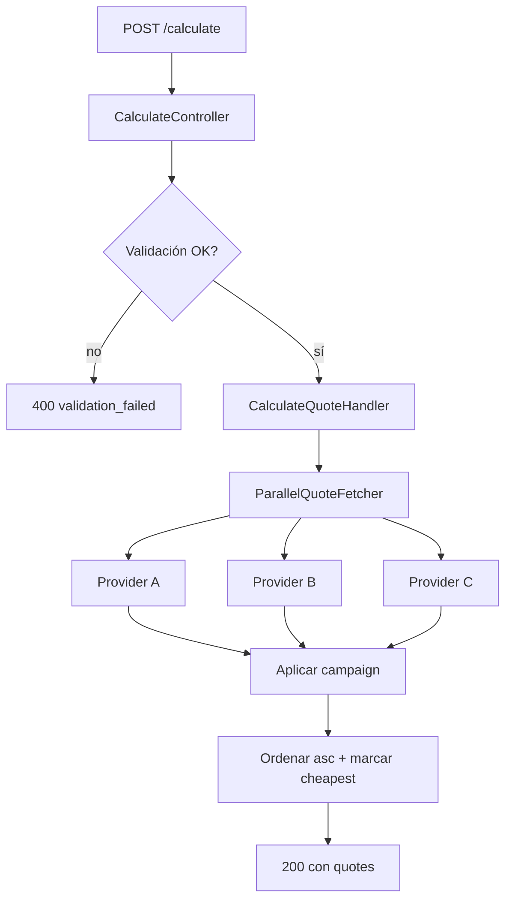

# DIR_api_docs — Directriz de Documentación Técnica del Proyecto

> **Nota de adaptación.** Esta directriz se ha adaptado al alcance del *code
> challenge CHECK24 — Comparación de seguros de coche* a partir de la versión
> 1.7 corporativa. Se conservan **todas las secciones y features** del original;
> los apartados que la plataforma corporativa cubre y este proyecto no
> (Kong, Kafka, multi-tenancy, JSONB, monorepo Quadrant) aparecen marcados como
> **N/A en este proyecto** con la nota de cómo se aplicarían si fuera necesario.

## Información del documento

| Campo                       | Valor                                                                                |
| --------------------------- | ------------------------------------------------------------------------------------ |
| **Código**                  | DIR_api_docs                                                                          |
| **Tipo**                    | Directriz de documentación técnica                                                    |
| **Versión**                 | 1.7-adapted-c24                                                                       |
| **Fecha**                   | 2026-05-14                                                                            |
| **Destinatarios**           | Mantenedores del repositorio `code-challenger-check24`                                |
| **Objetivo**                | Estandarizar la documentación técnica del backend Symfony y del frontend Vue          |
| **Mantenido por**           | Project owner                                                                         |
| **Frecuencia de revisión**  | Ante cualquier cambio relevante en el contrato `/calculate` o en el stack             |

## Resumen ejecutivo

> Esta directriz define el modelo de documentación técnica del repositorio:
> estructura de carpetas, formato de specs (OpenAPI + JSON Schema), documentación
> de dependencias, decisiones de arquitectura (ADRs), runbook, troubleshooting
> y validación CI/CD que garantiza que el spec sea la fuente de verdad.

**Principio fundamental.** El spec OpenAPI (`docs/specs/openapi/v1/openapi.yaml`)
es la **fuente de verdad** del contrato HTTP. Cualquier desviación entre el spec
y la implementación es un defecto a corregir, no una omisión a documentar.

**Directrices relacionadas (locales al proyecto).**

| Documento                                                     | Relación                                                                          |
| ------------------------------------------------------------- | --------------------------------------------------------------------------------- |
| [`docs/plan/constitution.md`](../plan/constitution.md)         | Principios fundacionales del proyecto                                              |
| [`docs/plan/requirements.md`](../plan/requirements.md)         | Requisitos funcionales y no funcionales                                            |
| [`docs/plan/specification.md`](../plan/specification.md)       | Contrato detallado de cada endpoint (esta directriz formaliza ese contrato)         |
| [`docs/plan/implementation.md`](../plan/implementation.md)     | Plan de implementación por fases                                                   |
| [`docs/plan/validation.md`](../plan/validation.md)             | Estrategia de validación y criterios de aceptación                                  |
| [`docs/plan/replanning.md`](../plan/replanning.md)             | Registro de decisiones (24 entradas) que motivan los ADRs                          |

## Estándares de referencia

| Estándar                                                                                    | Ámbito                                                |
| ------------------------------------------------------------------------------------------- | ----------------------------------------------------- |
| [OpenAPI 3.0.x](https://spec.openapis.org/oas/latest.html)                                  | Contrato de la API REST                                |
| [JSON Schema draft 2020-12](https://json-schema.org/specification)                          | Schemas de request / response / entidades compartidas |
| [Spectral](https://stoplight.io/open-source/spectral)                                       | Linting del spec OpenAPI                              |
| [RFC 9457 — Problem Details](https://www.rfc-editor.org/rfc/rfc9457)                        | Formato de errores                                    |
| [W3C TraceContext](https://www.w3.org/TR/trace-context/)                                    | Header `traceparent` para correlación distribuida     |

---

# 1. PROPÓSITO

Esta directriz define cómo se documenta el repositorio `code-challenger-check24`
para que:

- El contrato HTTP (`POST /calculate` + los tres `/provider-*/quote`) sea
  consumible por humanos e IA sin necesidad de leer el código.
- Cualquier revisor pueda ejecutar la aplicación, ejecutar los tests y entender
  las decisiones de arquitectura con sólo el contenido de `docs/`.
- Las desviaciones del plan original queden trazadas (ver `docs/plan/replanning.md`).
- La validación automática (lint, tests, type-check) bloquee merges incorrectos.

Es un proyecto de un solo servicio sin Kafka, sin Kong y sin base de datos
persistente: se mantienen todas las secciones del directorio original para que
el modelo siga siendo aplicable si el alcance crece, pero las marcadas como
**N/A en este proyecto** quedan documentadas como tales.

---

# 2. ALCANCE

**Aplica a:**

- El backend Symfony 7.3 / PHP 8.4 (`backend/`).
- El frontend Vue 3 / TypeScript / Vite (`frontend/`).
- La API REST `/calculate` y los tres endpoints simulados `/provider-{a,b,c}/quote`.
- La configuración Docker (`Makefile`, `docker-compose.yml`, `docker/`).

**No aplica a (y por tanto no documentado salvo nota explícita):**

- Eventos asíncronos — el proyecto no produce ni consume eventos.
- Kong API Gateway — el proyecto usa nginx directo sin gateway.
- Persistencia — no hay PostgreSQL/MySQL/Elasticsearch.
- Multi-tenancy / JWT — no aplica (no hay usuarios ni autenticación).
- Monorepo Quadrant — el proyecto vive en un único repositorio.

---

# 3. PRINCIPIOS DE DISEÑO

## 3.1 Spec como fuente de verdad

El spec OpenAPI (`docs/specs/openapi/v1/openapi.yaml`) es la **fuente de verdad**
del contrato HTTP del servicio. Adicionalmente, el bundle `nelmio/api-doc-bundle`
expone el mismo contrato en runtime en `http://localhost:8080/api/doc.json`
(derivado de las anotaciones `#[OA\*]` en los controladores). Ambos deben
mantenerse alineados: el primero como artefacto versionable en git, el segundo
como verificación en vivo.

## 3.2 Independencia del lenguaje

Las decisiones de estructura, lint y validación son las mismas que se aplicarían
a un servicio en Go, Python u otro lenguaje. Las únicas diferencias están en las
herramientas: PHPStan + PHP-CS-Fixer para PHP, ESLint + Prettier + vue-tsc para
TypeScript (ver §15).

## 3.3 Consumible por IA

Los specs y la documentación contienen suficiente contexto para que un agente
pueda regenerar código sin ambigüedad:

- Todos los campos con `description` no trivial.
- Todos los responses con `example`.
- `info.description` con contexto de dominio y propósito del servicio.
- Schemas con `title`, `description` y `examples` en cada propiedad.

## 3.4 Ownership explícito

Este es un proyecto de un único maintainer (el autor del code challenge). El
campo `x-owner` del spec se rellena con el email del autor.

## 3.5 Mermaid como estándar de diagramación

Los diagramas se escriben en **Mermaid incrustado en Markdown** — no como
imágenes externas, no como ficheros `.mmd` separados. Razones:

- **Versionable**: el diagrama evoluciona con el código en el mismo commit.
- **Revisable**: visible en el diff del MR, no en un archivo opaco.
- **Consumible por IA**: el texto del diagrama es parte del contexto que procesa
  el agente; una imagen PNG no lo es.
- **Cero fricción**: no requiere herramientas externas ni exports manuales.

La carpeta `docs/_assets/` se reserva para diagramas o capturas que **no
pueden** representarse en Mermaid (ej.: screenshots del frontend).

### Cuándo usar cada tipo de diagrama

| Tipo                  | Cuándo usarlo                                                  | Ejemplo en `docs/`                                |
| --------------------- | -------------------------------------------------------------- | -------------------------------------------------- |
| `flowchart` / `graph` | Flujos de ejecución con bifurcaciones                          | `functional/README.md` — flujo `/calculate`        |
| `sequenceDiagram`     | Interacciones entre componentes con orden temporal             | `functional/flows/calculate.md`                    |
| `graph LR`            | Mapa de dependencias del sistema                               | `database/dependency-map.md`                       |
| `stateDiagram-v2`     | Ciclo de vida de un quote (ok / failed / timeout)              | `architecture/business-rules.md`                   |

### Reglas

- Todo diagrama lleva título Markdown justo antes del bloque.
- Los identificadores de nodos en inglés; las etiquetas pueden ir en español.
- Mantener diagramas pequeños y enfocados (un concepto por diagrama).

### Ejemplo de referencia



---

# 4. ESTRUCTURA ESTÁNDAR DE DOCUMENTACIÓN

El repositorio sigue esta estructura dentro de `docs/`:

```
docs/
├── README.md                          # Índice maestro
├── changelog.md                       # Historial de cambios de docs y spec
├── glossary.md                        # Glosario de términos del dominio
│
├── plan/                              # Plan de proyecto (constitución, requisitos, spec, validación, replanning)
│   └── *.md                           # Documentos vivos heredados de la fase de planning
│
├── directives/                        # Directrices que rigen el repositorio
│   └── DIR_api_docs.md                # Este documento
│
├── specs/                             # Contratos formales (fuente de verdad)
│   ├── README.md
│   ├── openapi/
│   │   ├── README.md
│   │   └── v1/
│   │       └── openapi.yaml           # Spec OpenAPI 3.0 del servicio
│   ├── schemas/
│   │   ├── README.md
│   │   ├── requests/
│   │   │   ├── calculate.json
│   │   │   └── provider-a-quote.json
│   │   ├── responses/
│   │   │   ├── calculate.json
│   │   │   ├── provider-a-quote.json
│   │   │   └── problem-details.json
│   │   └── shared/
│   │       ├── money.json
│   │       └── quote.json
│   └── postman/
│       ├── README.md
│       ├── code-challenger-check24.postman_collection.json
│       └── code-challenger-check24.env.local.json
│
├── architecture/
│   ├── README.md                      # Visión general, patrones, diagrama de componentes
│   ├── dependencies.md                # Dependencias externas (composer / npm)
│   ├── business-rules.md              # Reglas observables: timeout, discount, tablas de pricing
│   └── adr/
│       ├── README.md                  # Índice de ADRs
│       ├── ADR-001-symfony-vue-stack.md
│       ├── ADR-002-parallel-fetch-via-httpclient-stream.md
│       └── ADR-003-quotefetcher-interface-for-testability.md
│
├── database/
│   ├── README.md                      # N/A en este proyecto + dependency map
│   └── dependency-map.md              # Diagrama de dependencias del sistema
│
├── functional/
│   ├── README.md                      # Flujos de negocio + códigos de error
│   └── flows/
│       └── calculate.md               # Flujo técnico detallado de /calculate
│
├── operations/
│   ├── README.md
│   ├── runbook.md                     # Diagnóstico de incidencias (INC-NNN)
│   ├── troubleshooting.md             # Problemas resueltos (PROB-NNN)
│   └── development.md                 # Guía de desarrollo local
│
└── _assets/                           # Capturas y diagramas no-Mermaid
    └── screenshot-*.png
```

## 4.1 Reglas de estructura

| Regla                                | Descripción                                                                              |
| ------------------------------------ | ---------------------------------------------------------------------------------------- |
| `README.md` en cada nivel            | Obligatorio. Sirve como índice y contexto.                                                |
| `changelog.md` en raíz de `docs/`    | Obligatorio. Historial de cambios significativos.                                         |
| `glossary.md` en raíz de `docs/`     | Obligatorio. Glosario del dominio.                                                        |
| `specs/` separado de docs narrativos | Los specs son contratos machine-readable; los narrativos son human-readable.              |
| Sin ficheros sueltos en raíz         | Todo fichero pertenece a una carpeta con propósito claro.                                 |
| `_assets/` para binarios             | Diagramas e imágenes van aquí, no dispersos por el árbol.                                 |

## 4.2 Qué es obligatorio y qué es opcional

| Carpeta / fichero                            | Obligatorio   | Condición                                                  |
| -------------------------------------------- | ------------- | ---------------------------------------------------------- |
| `docs/README.md`                              | Sí            | Siempre                                                    |
| `docs/changelog.md`                           | Sí            | Siempre                                                    |
| `docs/glossary.md`                            | Sí            | Siempre                                                    |
| `docs/specs/openapi/`                         | Sí            | El servicio expone una API REST                            |
| `docs/specs/schemas/`                         | Sí            | El servicio tiene request/response bodies                  |
| `docs/specs/postman/`                         | Recomendado   | Útil para validación manual                                 |
| `docs/architecture/dependencies.md`           | Sí            | Siempre                                                    |
| `docs/architecture/business-rules.md`         | Sí            | Hay reglas observables con valor concreto (timeout, %, …) |
| `docs/architecture/adr/`                      | Sí            | Mínimo el ADR del stack tecnológico                        |
| `docs/database/`                              | Sí            | Aunque no haya BD, el `dependency-map.md` es obligatorio   |
| `docs/database/dependency-map.md`             | Sí            | Siempre                                                    |
| `docs/functional/`                            | Sí            | Aplica el resumen de flujos del dominio                    |
| `docs/functional/flows/`                      | Recomendado   | El flujo `/calculate` tiene lógica cross-componente         |
| `docs/operations/runbook.md`                  | Sí            | Siempre                                                    |
| `docs/operations/troubleshooting.md`          | Sí            | Siempre                                                    |
| `docs/operations/development.md`              | Sí            | Siempre                                                    |

## 4.2.1 Documentación adicional para servicios complejos

Sin aplicabilidad en este proyecto: hay un único bounded context y cuatro
endpoints. Si en el futuro el alcance creciera por encima de 3 bounded contexts
o 50 endpoints, se añadirían `internal/architecture/bounded-contexts.md` e
`internal/api/api-contracts.md` por las mismas razones del original.

## 4.3 Glosario del servicio (`glossary.md`)

`docs/glossary.md` recoge los términos específicos del dominio del proyecto
(Provider, Campaign, Quote, RandomnessProvider, etc.). El formato y las reglas
son los del directorio original: tabla `| Término | Definición |`, sin
duplicar términos genéricos. Ver el fichero generado para el contenido actual.

## 4.4 Índice maestro (`docs/README.md`)

`docs/README.md` es el punto de entrada. Sigue esta estructura mínima:

```markdown
# code-challenger-check24

> Comparación de seguros de coche con tres proveedores simulados.

## Descripción
[2-3 frases sobre qué hace el servicio.]

## Stack tecnológico
| Capa | Tecnología | Versión |
|---|---|---|
| Lenguaje (backend) | PHP | 8.4 |
| Framework | Symfony | 7.3 |
| Lenguaje (frontend) | TypeScript | 5.x |
| Framework | Vue.js | 3.5 |
| Build (frontend) | Vite | 5.x |
| Reverse proxy | nginx | 1.27 |
| Runtime | Docker + Docker Compose | — |

## Índice de documentación
| Sección | Descripción |
|---|---|
| [Specs](specs/README.md) | Contrato OpenAPI + JSON Schemas + colección Postman |
| [Arquitectura](architecture/README.md) | Visión general, dependencias, ADRs |
| [Base de datos](database/README.md) | N/A — sólo contiene el mapa de dependencias |
| [Operaciones](operations/README.md) | Runbook, troubleshooting, desarrollo local |
| [Funcional](functional/README.md) | Flujos de negocio y códigos de error |
| [Plan](plan/) | Documentos vivos del diseño (constitución, spec, replanning) |
| [Glosario](glossary.md) | Términos del dominio |
| [Changelog](changelog.md) | Historial de cambios |

## Mantenedor
| Campo | Valor |
|---|---|
| **Autor** | jcmorodiaz@gmail.com |
| **Repositorio** | code-challenger-check24 |
```

## 4.5 Visión de arquitectura (`docs/architecture/README.md`)

Igual al original, con:

- Descripción del bounded context (un único contexto: "comparación de seguros").
- Tabla de patrones (DDD light: domain / application / infrastructure / UI).
- Stack tecnológico sincronizado con `docs/README.md`.
- Diagrama Mermaid de componentes (frontend → nginx → backend → 3 proveedores).
- Enlace a `adr/README.md` y a `dependencies.md`.

## 4.6 Reglas de negocio observables (`docs/architecture/business-rules.md`)

Recoge reglas con valor concreto:

- **TTLs y tiempos**: timeout de proveedor (10 s), latencias simuladas (2 s / 5 s / 1 s).
- **Constantes**: `CAMPAIGN_PERCENTAGE` (5%), `PROVIDER_TIMEOUT_SECONDS` (10).
- **Tablas de pricing**: una por proveedor, con `age_adjust` y `vehicle_adjust`.
- **Reglas de prioridad**: orden ascendente por `final_price`, desempate por `provider_id`.
- **Comportamiento ante errores**: provider failure → drop + log; 10 s timeout → drop.
- **Códigos de error**: `validation_failed` con `violations[]`.

## 4.7 Flujos de ejecución (`docs/functional/flows/`)

Recomendado para `/calculate`, donde la lógica tiene:

- Tres clientes HTTP con timeouts y reintentos distintos.
- Bifurcación en función de la randomness simulada.
- Un campaign provider con env-var de configuración.

El frontmatter del fichero incluye `last_verified`, `feature_flags`
(`CAMPAIGN_ACTIVE`), `sources` (`backend/src/Application/Calculate/...`) y
`related_docs`.

---

# 5. DOCUMENTACIÓN DE APIs REST (OpenAPI)

## 5.1 Formato y versión

- Formato: **YAML**.
- Versión usada: **OpenAPI 3.0.3**.
- Ubicación: `docs/specs/openapi/v1/openapi.yaml`.

El runtime expone el mismo contrato (derivado por Nelmio API Doc Bundle) en
`GET /api/doc.json` y la UI Swagger en `GET /api/doc`.

## 5.2 Campos obligatorios

### Nivel `info`

```yaml
info:
  title: "CHECK24 Car Insurance Comparison API"
  version: "1.0.0"
  description: |
    API de comparación de seguros de coche con tres proveedores simulados.
    Fan-out en paralelo, timeout de 10 s, descuento de campaña configurable.
  contact:
    name: "Project owner"
    email: "jcmorodiaz@gmail.com"
```

### Nivel `paths`

Cada endpoint DEBE incluir: `summary`, `description`, `operationId` en
`camelCase`, `tags` (mínimo uno), `parameters` documentados con `description`,
`example` y `schema`, `requestBody` con `description` y `example`, `responses`
con todas las clases (2xx, 4xx, 5xx) y al menos un `example` por respuesta.

### Nivel `components/schemas`

Cada schema DEBE incluir `title`, `description`, `required`, propiedades con
`description`, `type` y `example`, y restricciones (`format`, `enum`,
`minLength`/`maxLength`, `minimum`/`maximum`) cuando apliquen.

## 5.3 Alineamiento con convenciones REST

| Convención            | Reflejo en OpenAPI                                                            |
| --------------------- | ----------------------------------------------------------------------------- |
| Envelope estándar     | El campo raíz contiene `{ campaign, quotes, meta }` (no `{ data, metadata }`) |
| Errores RFC 9457      | Schema `ProblemDetails` reutilizable (sección 5.4)                            |
| Codes en SCREAMING_SNAKE_CASE | `validation_failed` en este proyecto (snake_case alineado con frontend)  |
| Header de correlación | `X-Correlation-Id` documentado en `components/headers` (futuro)               |
| `traceparent`         | W3C TraceContext — futuro; ahora `request_id` viaja en la línea de log         |

> **Nota.** La plataforma corporativa adopta el envelope `{ data, metadata }`.
> Este proyecto se ajusta literalmente a la spec del code challenge, que define
> `{ campaign, quotes, meta }`. Se acepta como desviación documentada.

## 5.4 Schema de error estándar (reutilizable)

`docs/specs/schemas/responses/problem-details.json` con la estructura RFC 9457:
`type`, `title`, `status`, `detail`, `code`, opcionalmente `errors[]`. El campo
`code` para este servicio toma el valor `validation_failed` cuando la entrada
no pasa los `Assert\*` del DTO o la edad calculada es < 18.

## 5.5 Tooling: Colección Postman

`docs/specs/postman/` contiene:

- Una colección con los 4 endpoints (`/calculate` + 3 `/provider-*/quote`).
- Un entorno `local` con `base_url=http://localhost:8080`.
- Variables: `base_url`, `birthday`, `car_type`, `car_use`.

Como no hay JWT/login, no aplican los scripts de login ni los headers
`X-Redis-Claim-*` del directorio original.

---

# 6. DOCUMENTACIÓN DE EVENTOS (AsyncAPI)

**N/A en este proyecto.** El servicio no produce ni consume eventos. Si en el
futuro se introdujera mensajería:

- Se crearía `docs/specs/asyncapi/eventos/<evento>.yaml` (AsyncAPI 3.0).
- Los headers (`messageName`, `__event_id`, `correlation_id`,
  `__time_of_recording`, `__time_of_recording_format`) seguirían la convención
  del directorio original.
- El payload `data` transportaría sólo IDs (DR_0007 §4.2 del directorio).

---

# 7. CONTRATOS DE DATOS (JSON Schema)

## 7.1 Alcance

| Tipo                  | Descripción                                                | Aplica   |
| --------------------- | ---------------------------------------------------------- | -------- |
| Request               | Body de `/calculate` y de los tres `/provider-*/quote`     | Sí       |
| Response              | Body de cada respuesta JSON / CSV / XML                    | Sí (JSON) |
| Evento producido      | —                                                          | **N/A**  |
| Evento consumido      | —                                                          | **N/A**  |
| Campo JSONB en BD     | —                                                          | **N/A**  |
| Contrato B2B          | No hay servicios internos consumidos                       | **N/A**  |

## 7.2 Formato y ubicación

- Formato: **JSON**.
- Ubicación: `docs/specs/schemas/`.
- `$id`: ruta relativa al repositorio (ej.: `schemas/responses/calculate.json`).

```
docs/specs/schemas/
├── README.md
├── requests/
│   ├── calculate.json
│   └── provider-a-quote.json
├── responses/
│   ├── calculate.json
│   ├── provider-a-quote.json
│   └── problem-details.json
└── shared/
    ├── money.json
    └── quote.json
```

## 7.3 Campos obligatorios

`$schema`, `$id`, `title`, `description`, `required`, propiedades con
`description` y `examples`, restricciones (`format`, `enum`, `pattern`, `minimum`/
`maximum`) cuando apliquen. Igual que en el original.

## 7.4 Schemas de campos JSONB

**N/A en este proyecto** — no hay base de datos.

## 7.5 Referencia desde OpenAPI

Los schemas se referencian con `$ref` relativo desde `docs/specs/openapi/v1/openapi.yaml`:

```yaml
requestBody:
  content:
    application/json:
      schema:
        $ref: "../../schemas/requests/calculate.json"

responses:
  '200':
    content:
      application/json:
        schema:
          $ref: "../../schemas/responses/calculate.json"
```

## 7.6 Validación de contratos en CI/CD

El pipeline (ver §15) valida:

- Los schemas son JSON Schema válidos (`ajv`).
- Los `$ref` resuelven.
- Cada endpoint en OpenAPI tiene su request/response referenciado.

---

# 8. CONFIGURACIÓN DE KONG

**N/A en este proyecto.** El proyecto usa nginx directo. Si se introdujera Kong:

- Se aplicarían las convenciones de naming (`{service}-{path}-{method}`),
  plugins (`jwt`, `rate-limiting`), timeouts (60 s) y hosts por entorno tal
  como define el directorio original §8.

---

# 9. DOCUMENTACIÓN DE INFRAESTRUCTURA DE DATOS

## 9.1 Propósito

Aún sin BD, el proyecto mantiene `docs/database/` por dos razones:

- `dependency-map.md` es obligatorio aunque no haya almacenamiento.
- Si el alcance crece y se introduce persistencia, la carpeta ya existe.

## 9.2 PostgreSQL / MySQL

**N/A.**

## 9.3 Elasticsearch

**N/A.**

## 9.4 Kafka

**N/A** — ver §6.

## 9.5 Mapa de dependencias

Ubicación: `docs/database/dependency-map.md`.

Documenta:

- Componentes internos (frontend, backend, nginx).
- Proveedores simulados (los tres endpoints `/provider-*/quote`).
- Variables de entorno de configuración (`CAMPAIGN_ACTIVE`, `PROVIDER_TIMEOUT_SECONDS`, `VITE_API_BASE`).
- Sin terceros reales, sin almacenes externos.

Formato Mermaid con leyenda (sólida = dependencia directa; punteada = config /
materialización; no aplica aquí).

---

# 10. DEPENDENCIAS EXTERNAS

## 10.1 Propósito

`docs/architecture/dependencies.md` documenta las dependencias estructurales
del backend y del frontend — aquellas que un desarrollador nuevo necesita
conocer para entender la arquitectura.

## 10.2 Monorepo Quadrant

**N/A** — el proyecto no consume paquetes del monorepo.

## 10.3 Otras dependencias estructurales

| Stack    | Dependencia                  | Versión        | Rol                                                      |
| -------- | ---------------------------- | -------------- | -------------------------------------------------------- |
| Backend  | `symfony/framework-bundle`   | 7.3.*          | Framework base                                            |
| Backend  | `symfony/http-client`        | 7.3.*          | Fan-out paralelo con `stream()`                          |
| Backend  | `symfony/validator`          | 7.3.*          | Validación de DTOs                                        |
| Backend  | `symfony/serializer`         | 7.3.*          | XmlEncoder para Provider B                                |
| Backend  | `symfony/monolog-bundle`     | ^4.0           | Logging estructurado JSON                                 |
| Backend  | `nelmio/cors-bundle`         | ^2.6           | CORS para el dev server de Vite                          |
| Backend  | `nelmio/api-doc-bundle`      | ^5.10          | OpenAPI runtime + Swagger UI                              |
| Backend  | `symfony/twig-bundle`        | ^7.3           | Render de la UI Swagger                                   |
| Backend  | `phpunit/phpunit` (dev)      | 13.x           | Suite de tests                                            |
| Backend  | `phpstan/phpstan` (dev)      | ^2.x           | Análisis estático nivel 8                                 |
| Backend  | `friendsofphp/php-cs-fixer`  | ^3.95          | Estilo (`@Symfony` + `@PER-CS`)                          |
| Frontend | `vue`                        | ^3.5           | Framework UI                                              |
| Frontend | `vue-router`                 | ^4.6           | Routing (single page + wizard)                            |
| Frontend | `vite`                       | ^8.0           | Dev server / build                                        |
| Frontend | `typescript`                 | ~6.0           | Tipado estricto                                           |
| Frontend | `vitest`                     | ^4.1           | Suite de tests                                            |
| Frontend | `@vue/test-utils`            | ^2.4           | Mount/render utilities                                    |
| Frontend | `eslint` + `typescript-eslint` | ^10            | Lint                                                      |
| Frontend | `prettier`                   | ^3.8           | Formatter                                                 |

---

# 11. ADRs (Architecture Decision Records)

## 11.1 Propósito

Las ADRs registran decisiones técnicas significativas. Este proyecto las usa
principalmente para los puntos donde la implementación se desvió del plan
original (ver `docs/plan/replanning.md`).

## 11.2 Cuándo escribir un ADR

- Elección de stack y de framework principal.
- Patrones de orquestación (fan-out paralelo, timeout, retry).
- Decisiones que crean seams para testabilidad.
- Desviaciones explícitas del plan inicial documentado.

## 11.3 Ubicación y naming

`docs/architecture/adr/ADR-NNN-descripcion-corta.md`.

## 11.4 Plantilla

Idéntica al directorio original (Estado, Fecha, Autores, Contexto, Decisión,
Alternativas, Consecuencias positivas/negativas, Riesgos operativos, Referencias).

## 11.5 Índice

`docs/architecture/adr/README.md` mantiene la tabla-índice `(ADR, Título, Estado, Fecha)`.

ADRs iniciales del proyecto:

- ADR-001 — Symfony 7.3 + Vue 3 como stack.
- ADR-002 — Fan-out paralelo via `HttpClient::stream()`.
- ADR-003 — `QuoteFetcher` interface introducida para testabilidad del handler.

---

# 12. DOCUMENTACIÓN FUNCIONAL

`docs/functional/README.md` contiene:

- **Flujo `/calculate`**: descripción narrativa.
- **Códigos de error del dominio**:
  | Código              | HTTP | Cuándo |
  |---------------------|------|--------|
  | `validation_failed` | 400  | DTO inválido o edad < 18 / > 120 |
- **Reglas de comportamiento**:
  - Si todos los proveedores fallan, se devuelve 200 con `quotes: []`.
  - El frontend muestra `"No hay ofertas disponibles."`.
- **Documentación complementaria**: enlace a `docs/plan/specification.md` (en
  lugar de Notion).

## 12.1 Flujos de ejecución técnica

`docs/functional/flows/calculate.md` con frontmatter:

```yaml
---
flow: calculate
status: active
sources:
  - backend/src/Application/Calculate/CalculateQuoteHandler.php
  - backend/src/Application/Provider/ParallelQuoteFetcher.php
feature_flags:
  - CAMPAIGN_ACTIVE: enciende/apaga el descuento del 5%
related_docs:
  - ../README.md
  - ../../architecture/business-rules.md
last_verified: 2026-05-14
---
```

---

# 13. DOCUMENTACIÓN OPERATIVA

## 13.1 Runbook (`runbook.md`)

Cubre las incidencias previsibles del proyecto:

- **INC-001** — Todos los proveedores fallan (10% + 5% + cualquier indisponibilidad real).
- **INC-002** — `/calculate` excede 10 s y devuelve menos quotes de las esperadas.
- **INC-003** — Conflicto de puerto al hacer `make up-d`.
- **INC-004** — Cache de Symfony corrupta tras cambio de config.

Cada incidencia documenta síntomas, diagnóstico (comandos `make logs`,
`make shell-backend`, etc.), causas comunes y resolución paso a paso.

## 13.2 Troubleshooting (`troubleshooting.md`)

Base de conocimiento poblada con problemas resueltos durante el desarrollo:

- **PROB-001** — `Could not find service "test.service_container"` al ejecutar
  WebTestCases (causa: `<server>` en phpunit.xml no propaga a `$_ENV`).
- **PROB-002** — `XmlEncoder` no autowireable (causa: Symfony Serializer no
  registra concretas; solución: alias explícito en `services.yaml`).
- **PROB-003** — MockResponse 5xx hace throw en el destructor durante stream.
- **PROB-004** — `JSON_PRESERVE_ZERO_FRACTION` requerido para que `5.0` no se
  serialice como entero.

## 13.3 Guía de desarrollo local (`development.md`)

Requisitos previos, variables de entorno (tabla sincronizada con `.env.example`),
levantar el servicio (`make up-d`), ejecutar tests (`make test`), tareas
habituales (regenerar spec, ver logs, parar y limpiar).

## 13.4 Diferencia entre runbook y troubleshooting

Igual al directorio original: runbook = procedimientos predefinidos para
incidencias; troubleshooting = problemas resueltos que pueden repetirse.

---

# 14. CHANGELOG

`docs/changelog.md` en orden cronológico inverso. Cada entrada:

```markdown
## [YYYY-MM-DD] Título del cambio

**Resumen:** descripción breve.

**Endpoints afectados:**
- **Añadidos:** ...
- **Modificados:** ...
- **Eliminados:** ...

**Cambios en schemas:** ...
**Impacto operacional:** ...
```

Se actualiza cuando: cambia el contrato HTTP, cambia un schema, cambia una regla
observable (timeout, %), cambia el stack.

---

# 15. VALIDACIÓN Y CI/CD

## 15.1 Pipeline de validación

Aunque el proyecto no tiene pipeline CI remoto activo (no es un repositorio
GitLab/GitHub Actions productivo), las equivalencias locales son:

| Paso                          | Comando local                                       | Bloquea |
| ----------------------------- | --------------------------------------------------- | ------- |
| Lint OpenAPI                  | (futuro) `spectral lint docs/specs/openapi/...`     | Sí      |
| Validar JSON Schemas          | (futuro) `ajv compile docs/specs/schemas/**/*.json` | Sí      |
| Tests backend (PHPUnit)       | `make test-backend`                                 | Sí      |
| Tests frontend (Vitest)       | `make test-frontend`                                | Sí      |
| PHPStan max                   | `make stan`                                         | Sí      |
| PHP-CS-Fixer dry-run          | `make cs`                                           | Sí      |
| ESLint                        | `make eslint`                                       | Sí      |
| Prettier --check              | `make prettier`                                     | Sí      |
| vue-tsc --noEmit              | `make typecheck`                                    | Sí      |

`make lint && make test` es la composición que un pipeline CI ejecutaría.

## 15.2 Configuración de Spectral

`.spectral.yaml` (futuro) en la raíz de `docs/specs/`:

```yaml
extends:
  - "spectral:oas"
rules:
  operation-description: error
  operation-operationId: error
  operation-tags: error
  oas3-api-servers: error
  info-description: error
  oas3-valid-media-example: warn
```

## 15.3 Pipeline de sync Kong

**N/A** — el proyecto no usa Kong.

## 15.4 Validación de consistencia (futuro)

El pipeline validaría:

- El spec en `docs/specs/openapi/v1/openapi.yaml` cubre todos los routes en
  `php bin/console debug:router` que no sean del framework.
- Cada endpoint OpenAPI tiene su schema de request / response.
- El stack en `docs/README.md` y `docs/architecture/README.md` coincide.

---

# 16. GENERACIÓN DESDE CÓDIGO

## 16.1 Objetivo

Generar (o al menos verificar) el spec OpenAPI desde anotaciones del propio
código, garantizando que spec e implementación no divergen.

## 16.2 Herramientas

| Stack     | Herramienta                  | Estado en el proyecto                                  |
| --------- | ---------------------------- | ------------------------------------------------------- |
| PHP / Symfony | `nelmio/api-doc-bundle` + `zircote/swagger-php` | **Activo**: anotaciones `#[OA\*]` en controllers; runtime expone `/api/doc.json` |
| Frontend  | TypeScript types             | **Activo**: `frontend/src/domain/types.ts` mirror manual del contrato JSON |

## 16.3 Flujo objetivo

```
Anotaciones #[OA\*] en controllers ─► nelmio_api_doc.controller.swagger ─► /api/doc.json
                                                                              ↓
                                                                       Diff vs docs/specs/openapi/v1/openapi.yaml
                                                                              ↓
                                                                       Bloquea merge si difieren (futuro)
```

## 16.4 Criterios

Las anotaciones del código deben cubrir todos los campos obligatorios de §5.2.
El fichero `docs/specs/openapi/v1/openapi.yaml` es el artefacto versionable; el
endpoint runtime es la verificación.

---

# 17. GLOSARIO

Términos usados en esta directriz y en la documentación del proyecto.

| Término                     | Definición                                                                                                                                  |
| --------------------------- | ------------------------------------------------------------------------------------------------------------------------------------------- |
| **ADR**                     | Architecture Decision Record. Documento que registra una decisión técnica significativa (contexto / decisión / alternativas / consecuencias). |
| **Bounded context**         | Límite explícito de un modelo de dominio. Este proyecto tiene un único contexto: comparación de seguros.                                     |
| **Campaign**                | Descuento del 5% aplicado a cada quote cuando `CAMPAIGN_ACTIVE=true`.                                                                        |
| **CarForm / CarType / TipoCoche / UsoCoche** | Enums de vocabulario: `CarType` es lo que el usuario ve; el resto son vocabularios de cada proveedor.                                |
| **CalculateQuoteHandler**   | Caso de uso aplicación: orquesta fetcher → discount → sort → cheapest.                                                                        |
| **Clock**                   | Interface inyectada para que `sleep()` y `now()` sean reemplazables en tests por `FakeClock`.                                                |
| **Cheapest**                | Quote marcado con `is_cheapest: true`; exactamente uno cuando hay ≥ 1 quote.                                                                 |
| **FetchResult**             | Value object devuelto por `QuoteFetcher`: `quotes[]`, `failedProviderIds[]`, `outcomes` por proveedor.                                       |
| **JSON Schema**             | Fichero JSON que define la estructura de un body. Versión: draft 2020-12.                                                                    |
| **`messageName`**           | Header de Kafka — **N/A en este proyecto**.                                                                                                  |
| **OpenAPI**                 | Especificación machine-readable del contrato HTTP. Versión: 3.0.3.                                                                           |
| **`operationId`**           | Identificador único por operación HTTP. Formato `camelCase`.                                                                                 |
| **Owner**                   | Único maintainer del repositorio. Aplicable como propietario del spec.                                                                       |
| **ParallelQuoteFetcher**    | Implementación de `QuoteFetcher` que abre 3 requests en paralelo via `HttpClient::stream()` con timeout 10 s.                                |
| **Problem Details (RFC 9457)** | Formato HTTP estándar para errores. Implementado en `ProblemDetails.json`.                                                                   |
| **Provider**                | Proveedor de seguro simulado. Tres en este proyecto: provider-a (JSON), provider-b (XML), provider-c (CSV).                                  |
| **`provider_id`**           | Identificador estable de cada proveedor: `provider-a`, `provider-b`, `provider-c`.                                                            |
| **Quote**                   | Cotización individual: `{ provider, price, discounted_price, is_cheapest }`.                                                                 |
| **RandomnessProvider**      | Interface inyectada para que la aleatoriedad del 10% / 1% / 5% sea determinista en tests.                                                    |
| **`request_id`**            | UUID hex generado por `CalculateQuoteHandler` para correlar la línea de log JSON con una request concreta.                                   |
| **Spec**                    | Fichero formal machine-readable: OpenAPI o JSON Schema. **Fuente de verdad** del contrato.                                                   |
| **Spectral**                | Linter de specs OpenAPI / AsyncAPI. Pendiente de cableo en este proyecto.                                                                    |
| **Tenant**                  | **N/A** — el proyecto no es multi-tenant.                                                                                                    |
| **`traceparent`**           | Header HTTP W3C TraceContext. Documentado en el spec, no usado en runtime aún.                                                              |
| **UsoCoche / `car_use`**    | Tipo de uso del coche: `Privado` o `Comercial`. El backend acepta también el sinónimo `Commercial`.                                          |

---

# 18. CHECKLIST OBLIGATORIO ANTES DE MERGE

### Estructura

- [ ] `docs/README.md` existe, enlaza todas las secciones y refleja el stack actual (§4.4).
- [ ] `docs/changelog.md` tiene entrada para los cambios de este PR.
- [ ] `docs/glossary.md` existe (§4.3).
- [ ] `docs/architecture/README.md` existe con descripción, patrones y diagrama (§4.5).
- [ ] Cada carpeta de `docs/` tiene su `README.md`.
- [ ] Diagramas e imágenes en `docs/_assets/`.

### Contratos de datos (JSON Schema)

- [ ] Cada endpoint con request body tiene schema en `docs/specs/schemas/requests/`.
- [ ] Cada endpoint con response body tiene schema en `docs/specs/schemas/responses/`.
- [ ] Eventos / JSONB **N/A** en este proyecto.
- [ ] Todos los schemas tienen `$schema`, `$id`, `title`, `description`.
- [ ] Todas las propiedades tienen `description` y `examples`.
- [ ] Los `$ref` resuelven sin errores.

### OpenAPI

- [ ] `docs/specs/openapi/v1/openapi.yaml` existe y es válido.
- [ ] `info.description` incluye contexto.
- [ ] Todos los endpoints tienen `summary`, `description`, `operationId`, `tags`.
- [ ] Todos los responses tienen `examples`.
- [ ] Request/response schemas referenciados desde `docs/specs/schemas/`.
- [ ] Errores con schema `ProblemDetails`.
- [ ] El runtime (`/api/doc.json`) coincide con el spec versionable.

### AsyncAPI / Kong / Kafka

- [ ] **N/A** — declarado explícitamente en §6, §8 y §9.4.

### Infraestructura de datos

- [ ] `docs/database/dependency-map.md` actualizado.

### Dependencias externas

- [ ] `docs/architecture/dependencies.md` refleja `composer.json` y `package.json` actuales.

### Arquitectura

- [ ] `docs/architecture/business-rules.md` recoge timeouts, %, randomness, tablas de pricing.
- [ ] Decisiones significativas tienen ADR con sección "Riesgos operativos".
- [ ] `docs/architecture/adr/README.md` tiene tabla-índice actualizada.

### Documentación operativa

- [ ] `docs/operations/runbook.md` con diagnóstico rápido e `INC-NNN`.
- [ ] `docs/operations/troubleshooting.md` con `PROB-NNN`.
- [ ] `docs/operations/development.md` con `.env`, comandos y tareas habituales.

### Documentación funcional

- [ ] `docs/functional/README.md` con flujos principales y códigos de error.
- [ ] `docs/functional/flows/calculate.md` con frontmatter y `last_verified` actualizado.

---
