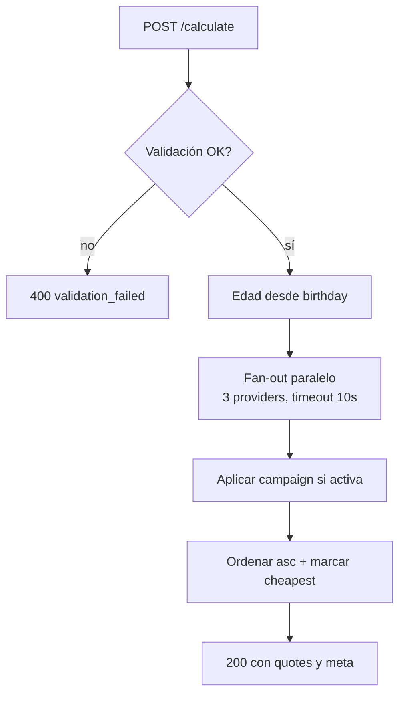

# Documentación funcional — code-challenger-check24

> Resumen funcional del servicio. La especificación detallada vive en
> [`docs/plan/specification.md`](../plan/specification.md); esta página es
> el "qué hace" en lenguaje de producto.

## Flujos principales

### Calcular comparación (`/calculate`)

El usuario rellena el formulario en `/` (o navega los tres pasos del wizard
`/wizard/step{1,2,3}`) e indica:

- Su fecha de nacimiento.
- El tipo de coche (`Turismo`, `SUV`, `Compacto`).
- El uso del coche (`Privado`, `Comercial`).

Al pulsar **Calcular** el frontend hace `POST /calculate` con el payload
JSON. El backend:

1. Valida los campos. Si la edad calculada queda fuera de `[18, 120]`
   devuelve `400 validation_failed`.
2. Llama en paralelo a los tres proveedores con un timeout de **10 segundos**
   por proveedor.
3. Aplica un descuento del **5 %** si la campaña está activa.
4. Ordena los presupuestos supervivientes **ascendentes por precio final**
   y marca el más barato.

La UI renderiza la tabla de resultados, resalta el más barato, y muestra un
banner si la campaña está activa. Si **todos** los proveedores fallan, la UI
muestra el literal `"No hay ofertas disponibles."`.

**Reglas observables del flujo:**

- Edad permitida: **18 años o más**, hasta 120.
- Timeout por proveedor: **10 s**. Por encima, el proveedor se omite del
  resultado y se registra en `meta.failed_providers`.
- Descuento de campaña: **5 %**, configurable via `CAMPAIGN_PERCENTAGE`.
- Orden de los resultados: por **precio final** ascendente; empate por
  `provider_id` alfabético.

Diagrama de alto nivel:

### Wizard de 3 pasos (`/wizard`)

Alternativa al formulario single-page para el bonus senior. Tres pasos
(birthday / car_type / car_use) con navegación Back/Continue y transiciones
laterales tipo iOS. El estado se comparte entre pasos mediante
`provide/inject` de las composables `useFormState` y `useCalculate`. Al
completar el último paso, el usuario llega a `/wizard/result` donde se
ejecuta el mismo `POST /calculate` y se renderiza la misma tabla.

## Códigos de error del dominio

| Código              | HTTP | Cuándo                                                                              |
| ------------------- | ---- | ----------------------------------------------------------------------------------- |
| `validation_failed` | 400  | DTO inválido o edad fuera de `[18, 120]`. El cuerpo incluye `violations[]` por campo. |

> No hay códigos propios para errores de proveedor — los fallos (5xx, timeout,
> body no parseable) se filtran del resultado y aparecen en
> `meta.failed_providers` con un response 200.

## Tasas de fallo simuladas

| Proveedor   | Latencia          | Probabilidad de fallo            | Comportamiento                                                       |
| ----------- | ----------------- | --------------------------------- | -------------------------------------------------------------------- |
| provider-a  | 2 s               | 10 %                              | HTTP 500 → orquestador lo marca `failed`, sigue con los otros        |
| provider-b  | 5 s (normal) / 60 s (spike) | 1 % de spike            | El spike excede el timeout → orquestador lo marca `timeout`         |
| provider-c  | 1 s               | 5 %                               | HTTP 503 → orquestador lo marca `failed`                              |

## Documentación complementaria

- **Especificación detallada (contrato):** [`../plan/specification.md`](../plan/specification.md)
- **Reglas observables (timeouts, %, pricing):** [`../architecture/business-rules.md`](../architecture/business-rules.md)
- **Flujo técnico paso a paso:** [`flows/calculate.md`](flows/calculate.md)
- **Capturas de pantalla:** [`../_assets/`](../_assets/)
