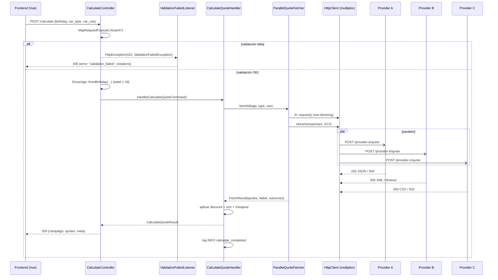

# Flujo: /calculate

## Visión general

## Almacenes y ciclos de vida

**Ninguno persistente.** El handler:

- No escribe en disco (más allá del log).
- No usa caché (Redis / APCu).
- No mantiene estado entre requests.

El único "almacén" es la **memoria de la request**: `FetchResult`,
`CalculateQuoteResult` y los objects intermedios viven hasta que la respuesta
HTTP sale del controller.

## Selección de path

| Condición                                     | Path                                                     |
| --------------------------------------------- | -------------------------------------------------------- |
| DTO inválido (`Assert\*` falla)               | `MapRequestPayload` → `ValidationFailedListener` → 400   |
| DTO válido pero `driver_birthday > today`     | Controller devuelve 400 inline (no llega al handler)     |
| Edad calculada < 18                           | Controller devuelve 400 inline                           |
| Edad calculada > 120                          | Lo lanza `DriverAge::__construct` → controller convierte a 400 |
| Validación OK                                 | Handler → fan-out → discount → sort → cheapest           |

## Feature flags por entorno

| Variable                | Valor por defecto         | Efecto                                                |
| ----------------------- | ------------------------- | ----------------------------------------------------- |
| `CAMPAIGN_ACTIVE`       | `true` (dev), `true` (.env) | Activa/desactiva el descuento del 5 %                |
| `CAMPAIGN_PERCENTAGE`   | `5.0`                     | Porcentaje del descuento                              |
| `PROVIDER_TIMEOUT_SECONDS` | `10`                   | Timeout del fan-out paralelo                          |

## Contratos implícitos

Aspectos del flujo que no aparecen en el spec OpenAPI pero que el código
asume:

- **`Clock::now()` es UTC.** `DriverAge::fromBirthday()` resta dos
  `\DateTimeImmutable` sin convertir zonas. El test fija el clock a
  `2026-05-13 UTC` para que las edades sean deterministas.
- **`request_id`** es único por invocación del handler (hex 16 chars de
  `random_bytes(8)`). No se propaga al cliente — sólo aparece en la línea de
  log. Si en el futuro se quisiera devolverlo al cliente, habría que añadir
  un header de response.
- **El sorting es estable.** `usort` de PHP 8.0+ es estable, así que el
  desempate por `provider_id` alfabético se aplica de forma determinista.

## Pitfalls y errores conocidos

| Pitfall                                                             | Cómo se evita                                                                       |
| ------------------------------------------------------------------- | ----------------------------------------------------------------------------------- |
| `HttpClient::stream()` lanza `ServerException` para non-2xx          | El fetcher llama `getStatusCode()` en `isFirst()` para limpiar el initializer flag  |
| `MockResponse::__destruct()` lanza para 5xx no leídos                | El fetcher llama `$response->cancel()` cuando filtra el quote                       |
| JSON serializa `5.0` como `5` (entero)                              | `JsonResponse` configurado con `JSON_PRESERVE_ZERO_FRACTION`                        |
| Race entre `Continue` del wizard y debounce 200 ms de `useFormState` | `useFormState` flushea en `onBeforeUnmount` antes de la transición de ruta          |

## Errores y recuperación

| Escenario                                  | Comportamiento del orquestador                                                 |
| ------------------------------------------ | ------------------------------------------------------------------------------ |
| Un proveedor falla                         | Se marca `failed` en outcomes y se omite del array `quotes`; respuesta 200      |
| Dos proveedores fallan                     | Sólo el superviviente; respuesta 200                                            |
| Los tres fallan                            | `quotes: []` + tres ids en `failed_providers`; UI muestra "No hay ofertas..."  |
| Excepción no controlada en el handler      | Symfony devuelve 500 con su página de error; el log captura el stack            |

No hay reintentos. La filosofía del orquestador es **fail-fast por proveedor,
seguir adelante con los demás**.
